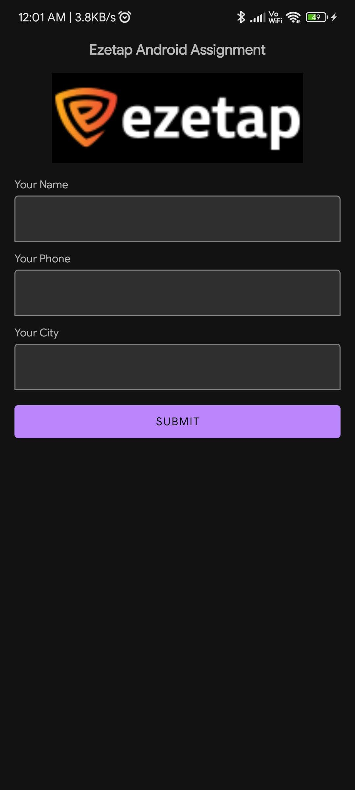
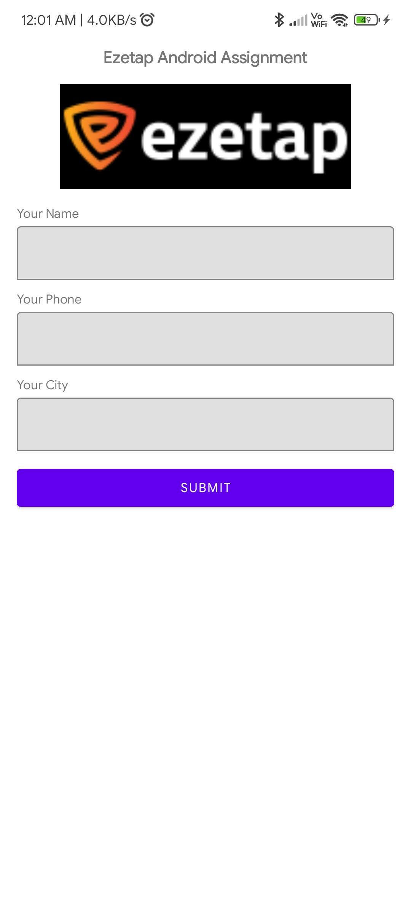
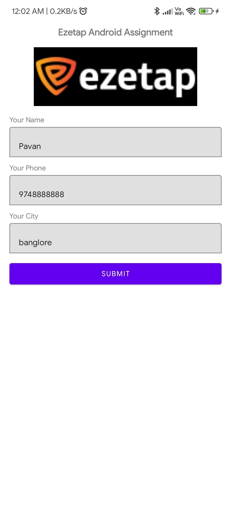
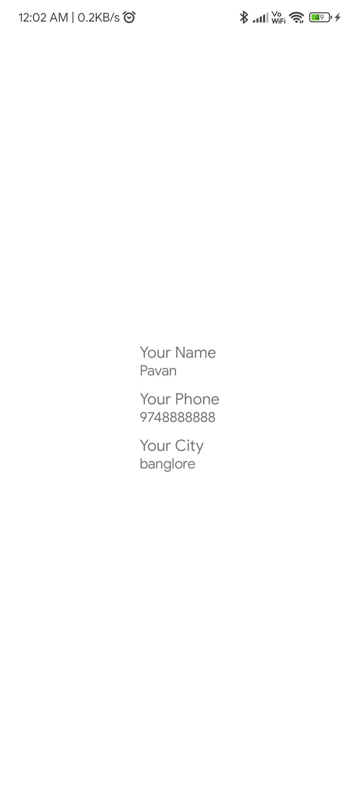

# ezetap
ezetap assignment

 
    
## 📸 Video

https://user-images.githubusercontent.com/24766565/164991982-8c3eb973-51cf-4442-9b14-b573abada688.mp4

## 📸 Screenshots

||||
|:----------------------------------------:|:-----------------------------------------:|:-----------------------------------------: |
|  |  |  |
|  |  |     |

## Built With 🛠
- [Kotlin](https://kotlinlang.org/) - First class and official programming language for Android development.
- [Coroutines](https://kotlinlang.org/docs/reference/coroutines-overview.html) - For asynchronous and more..
- [Flow](https://kotlin.github.io/kotlinx.coroutines/kotlinx-coroutines-core/kotlinx.coroutines.flow/-flow/) - A cold asynchronous data stream that sequentially emits values and completes normally or with an exception.
- [Android Architecture Components](https://developer.android.com/topic/libraries/architecture) - Collection of libraries that help you design robust, testable, and maintainable apps.
  - [ViewBinding](https://developer.android.com/topic/libraries/view-binding) - Generates a binding class for each XML layout file present in that module and allows you to more easily write code that interacts with views.
- [Dependency Injection](https://developer.android.com/training/dependency-injection) -
  - [Hilt-Dagger](https://dagger.dev/hilt/) - Standard library to incorporate Dagger dependency injection into an Android application.
  - [Hilt-ViewModel](https://developer.android.com/training/dependency-injection/hilt-jetpack) - DI for injecting `ViewModel`.
- Backend
- [Retrofit](https://square.github.io/retrofit/) - A type-safe HTTP client for Android and Java.
- [GSON](https://github.com/google/gson) - A modern JSON library for Kotlin and Java.
- [GSON Converter](https://github.com/square/retrofit/tree/master/retrofit-converters/gson) - A Converter that uses Moshi for serialization to and from JSON.
- [Material Components for Android](https://github.com/material-components/material-components-android) - Modular and customizable Material Design UI components for Android.

## Architecture
This app uses [***MVVM (Model View View-Model)***](https://developer.android.com/jetpack/docs/guide#recommended-app-arch) architecture.

Single Activity Architecture

## Contact 📩

 
